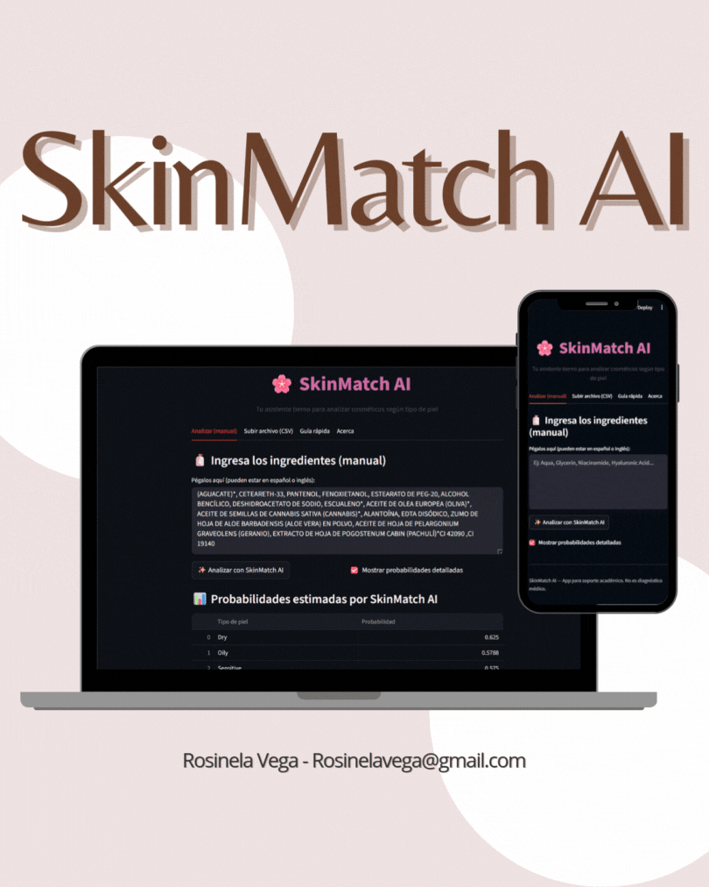

# 🌸 **SkinSoft AI — Recomendador Inteligente según Tipo de Piel**

Tu asistente tierno y preciso que analiza ingredientes cosméticos (INCI) y predice qué tipo de piel tolerará mejor un producto.  
Basado en Machine Learning, dermatología y procesamiento de texto.

---

## 🏷️ **Badges**

---

## ✨ **Descripción General**

**SkinMatch AI** es una herramienta de Machine Learning que analiza listas de ingredientes cosméticos y predice su compatibilidad con los 5 tipos principales de piel:

- 🩷 Sensitive  
- 💧 Dry  
- 🛢 Oily  
- 🌿 Combination  
- ✨ Normal  

El modelo final usa:

✔ Procesamiento TF-IDF  
✔ Feature Engineering dermatológico  
✔ Random Forest Multilabel  
✔ Pipeline consolidado  
✔ Interfaz Streamlit fácil de usar

---

## 🧠 **Cómo funciona SkinMatch AI**

### **1️⃣ Limpieza & Traducción automática**
- Estandarización de ingredientes  
- Conversión español → inglés (agua → water, glicerina → glycerin, etc.)  
- Eliminación de símbolos y ruido textual  

### **2️⃣ Feature Engineering dermatológico**
El sistema detecta:

- Ingredientes irritantes  
- Aceites y emolientes  
- Ingredientes calmantes  
- Ratios por cantidad  
- Largos y conteos  
- TF-IDF ngramas para semántica del INCI

### **3️⃣ Entrenamiento de modelos**
Se evaluaron 6 modelos supervisados:

- Logistic Regression  
- Random Forest  
- Gradient Boosting  
- SVC  
- KNN  
- Naive Bayes  

Además:

- 1 modelo **no supervisado** (K-Means)  
- 5 Random Forest independientes  
- 1 Multilabel Random Forest (modelo final)

---

## 📊 **Resultados Principales**

### ✔ Mejor modelo final
**Random Forest Multilabel Pipeline**

- Mejor equilibrio entre precisión por clase  
- Mejor recall en clases con baja representación  
- Predicciones más estables  
- Único modelo capaz de predecir múltiples tipos de piel simultáneamente  

---
# 🌸 SkinMatch AI — Vista previa de la interfaz

**Interfaz simple, clara y pensada para usuarios no técnicos.**  
A continuación una vista rápida de las funciones principales que verás en la app.

## 🎛️ Pantalla principal — Resumen rápido

| 🧴 Ingresar ingredientes | 📊 Tabla de probabilidades | 🌟 Recomendación |
|---:|:---:|:---|
| Pega la lista INCI (es/eng) | Probabilidades por tipo de piel | Tipo de piel más compatible (recomendación) |
| Soporta comas y paréntesis | Ordenadas de mayor a menor | Mensaje claro: *“Ideal para: Normal”* |
| Traducción automática básica | Descarga CSV con resultados | Aviso: **no sustituye dermatólogo** |

---

## ✨ Secciones destacadas

- **🧴 Ingresa tus ingredientes**  
  Campo de texto grande para pegar la lista INCI (o escribirla).

- **📊 Tabla de probabilidades**  
  Muestra la probabilidad de compatibilidad con:  
  **Sensitive · Dry · Oily · Combination · Normal**.

- **🌟 Recomendación principal**  
  Texto grande y claro: *“Recomendado para: Normal”* + barra visual.

- **📘 Guía educativa de tipos de piel**  
  Explicaciones cortas y consejos (ej. qué ingredientes evitar si eres Sensitive).

- **📂 Carga de archivos (CSV / TXT)**  
  Subida por lote: procesa todo el CSV y devuelve un archivo con probabilidades.

---

## 🖼️ Mockup Vista previa

---

# ⚠️ **Limitaciones del Proyecto**

Aunque SkinMatch AI ofrece predicciones precisas y útiles, todavía existen varias limitaciones importantes que deben considerarse:

### 🚫 No considera concentraciones reales
El modelo solo analiza la presencia del ingrediente, no su porcentaje en la fórmula — y la concentración determina la tolerancia real en piel.

### 🧪 Ingredientes ambiguos
No distingue entre:
- Alcoholes grasos (buenos)
- Alcoholes secantes (malos)

Las palabras clave pueden agrupar ambos bajo "alcohol".

### 🍋 Penalización a ácidos suaves
Ingredientes como mandelic acid o PHA aparecen como ácidos “irritantes” aunque sean más compatibles con piel sensible.

### 📦 Dataset limitado
Proviene de fuentes comerciales y no incluye:
- Edad del consumidor  
- Problemas dermatológicos reales  
- Concentración química  
- Historial de uso  

---

# 🔭 **Próximos Pasos**

Para mejorar SkinMatch AI en futuras versiones:

### 🧠 Implementar SHAP (explicabilidad)
Permitiría entender *por qué* el modelo decide cada recomendación.

### 🤖 Embeddings avanzados (BERT / Cosmetic-BERT)
Mejor comprensión semántica de ingredientes, sin depender de palabras clave.

### 🌐 API REST
Despliegue para que tiendas y apps puedan integrarlo fácilmente.

### 🔤 Mejor traducción INCI
Agregar diccionarios ampliados y sinonimia para español–inglés.

### 📊 Dashboard empresarial
Reportes de compatibilidad masivos:
- Catálogo completo  
- Comparación entre marcas  
- Riesgo por categoría  

---

# 📜 **Licencia**

Este proyecto fue desarrollado con fines educativos.  
No sustituye evaluaciones dermatológicas profesionales ni está aprobado por entidades de salud.

---

# 👩‍💻 **Autora**

**Rosinela Vega** — Proyecto Final de Machine Learning  
📧 *Rosinelavega@gmail.com*  

---

